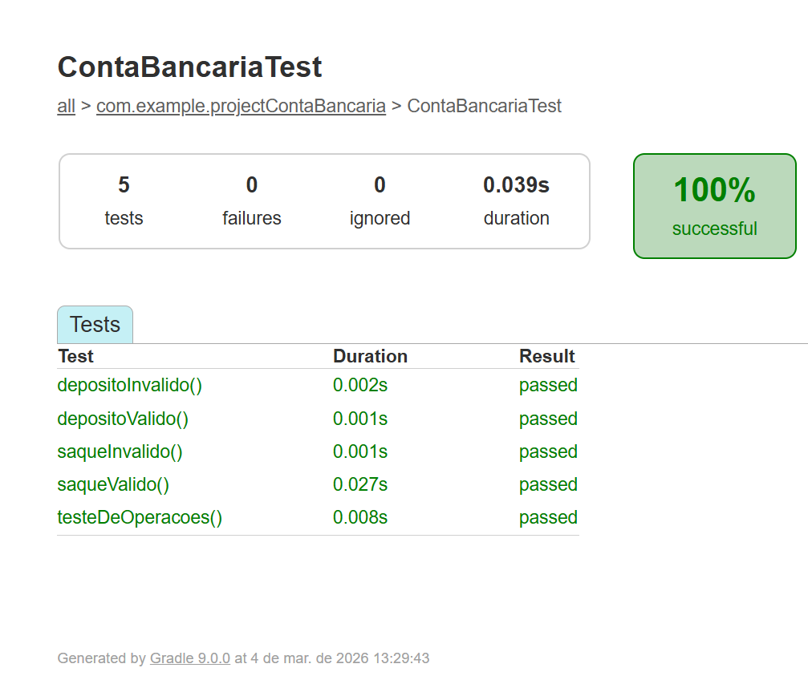

# Atividade: Conta Bancária com Testes Automatizados

## Como executar os testes

Os testes podem ser executados de duas maneiras:

**1. Pela IDE (IntelliJ IDEA)**
* Navegue até a pasta `src/test/java/com/example/projectContaBancaria`.
* Abra o arquivo `ContaBancariaTest.java`.
* Clique no ícone verde de execução (Run) ao lado da declaração da classe.

**2. Pelo Terminal (via Gradle)**
* Abra o terminal na raiz do projeto.
* Digite o comando abaixo e pressione Enter:
  `gradlew test`
* O Gradle irá compilar o projeto e executar toda a suíte de testes automaticamente.

## Resultado da execução

## Aplicação dos conceitos

Iniciei o projeto configurando o ambiente com o Gradle e adicionando as dependências do JUnit e, a partir disso, apliquei 
os conceitos vistos em aula de desenvolver primeiro os testes antes da implementação das classes correspondentes, 
o que facilitou o acompanhamento do progresso, uma vez que qualquer falha nos testes indicava uma possível 
existência de erros na lógica da classe ContaBancaria do main.
Nesse processo, mantive a aplicação do padrão AAA (<i>Arrange, Act, Assert</i>) em todos os testes.
Dessa maneira, eu sempre iniciava criando uma instância da classe ContaBancaria, realizava a operação desejada e, 
por fim, verificava se o comportamento estava condizente com o esperado. Para as validações de igualdade, 
utilizei o método assertEquals, enquanto para o monitoramento de exceções e casos de erro, apliquei o assertThrows
associado ao IllegalArgumentException, para que a o código correspondesse às entradas inválidas que a atividade tinha definido.

## A importância dos testes automatizados

Os testes automatizados ajudam a garantir a qualidade do software ao validarem continuamente se o código atende aos requisitos planejados,
assim, eles previnem "regressões" no sistema, pois possibilitam verificar que novas alterações não quebrem funcionalidades já existentes 
no projeto, o que traz mais segurança e resulta em um sistema mais confiável e estável.

